# Master Games: Kids Matching Game 🧩

**Master Games**
is a simple kids educational matching game for learning colors, animals, fruits, and more through a classic matching pairs challenge. The App and the content is prepared in three different languages, Amharic, English and Arabic. It also supports different theme colors for personalized experience.It helps children learn more than 250 basic words (names) from three different languages.

## 📥 Download

Get the latest version of **Master Games: Kids Matching Game** for your Android device:

[Get it on APKPure ](https://apkpure.com/p/com.example.flutter_kids_matching_game) 

[Download APK (v1.5.0)](https://drive.google.com/file/d/1klnvpyvcLgPSozqDZhEvcUTwdeDn0mwd/view?usp=sharing)

## Features

- **Learn & Play:** Combines fun gameplay with educational content.
- **Multiple Categories:** Match items from various categories:
  - Animals 🐦
  - Colors 🎨
  - Fruits 🍎

**Screenshot 1: Main Menu / Game Type Selection**

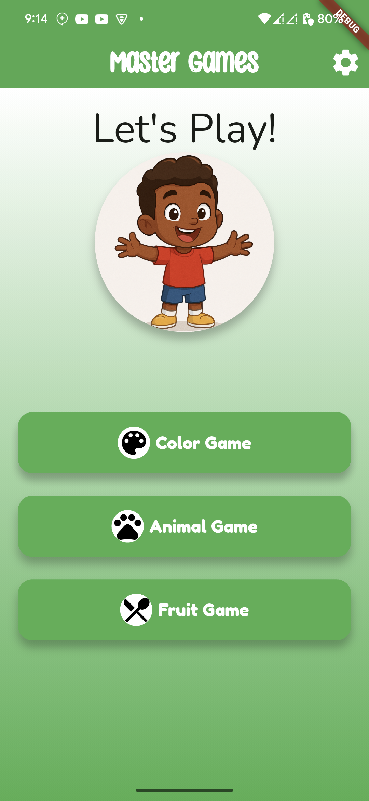

**Screenshot 2: Main Menu /( Animal Game/ Color Game/ Fruit Game)**

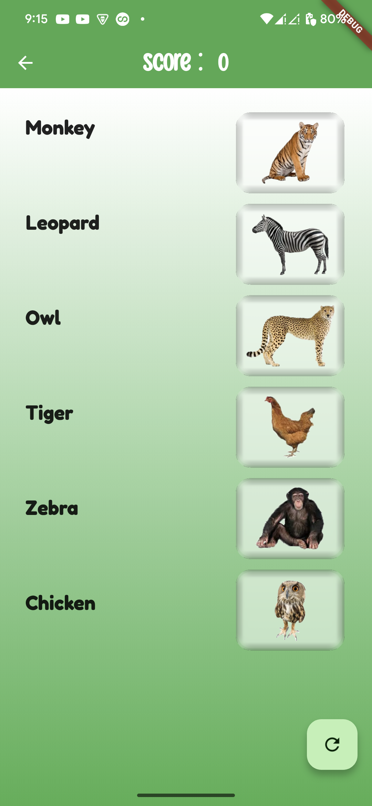
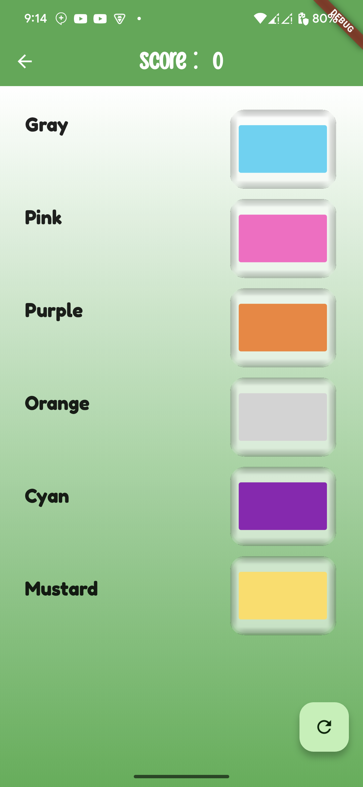
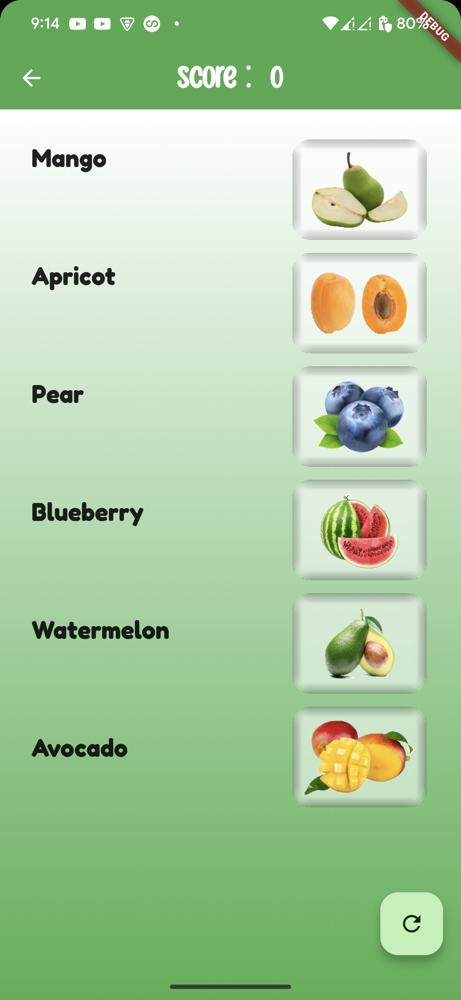

- **Progressive Difficulty:** Multiple levels with increasing difficulty, up to 5 levels fro each game.
- **Vibrant Graphics:** Colorful and kid-friendly visuals.
- **Customizable Themes:** Personalize the game's appearance with different theme colors - up to 6 different theme colors.
- **Intuitive Interface:** Easy for young children to navigate and play.

**Screenshot 5: App Theme Options**

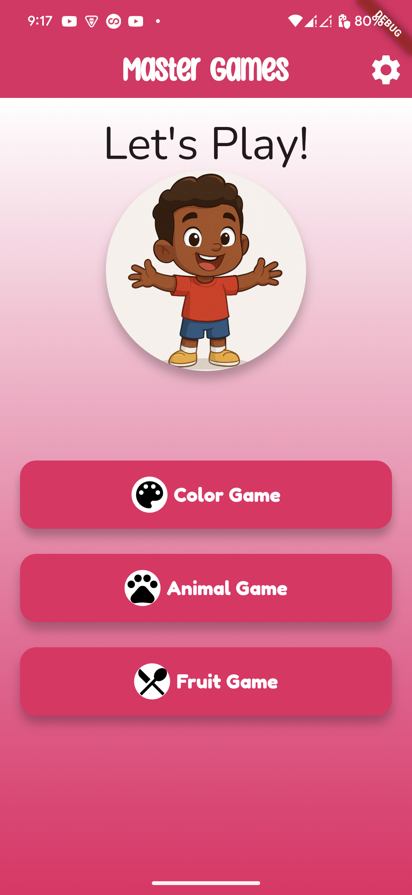
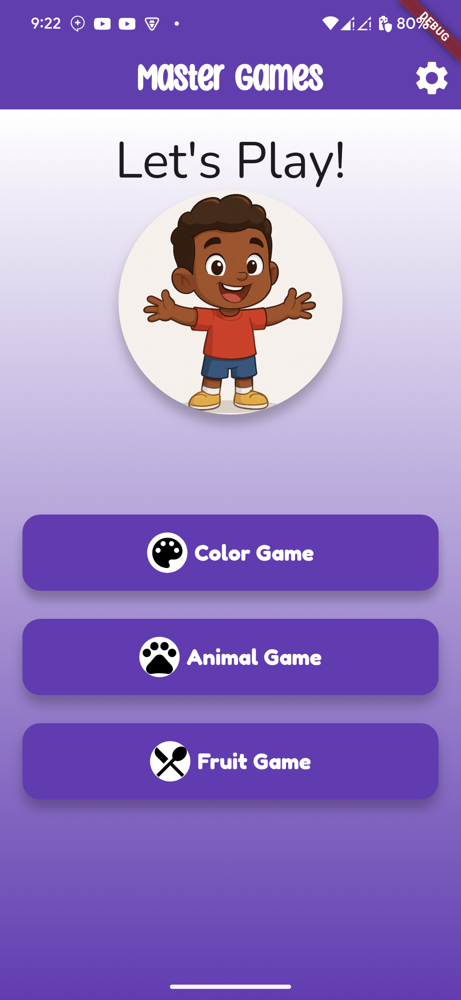
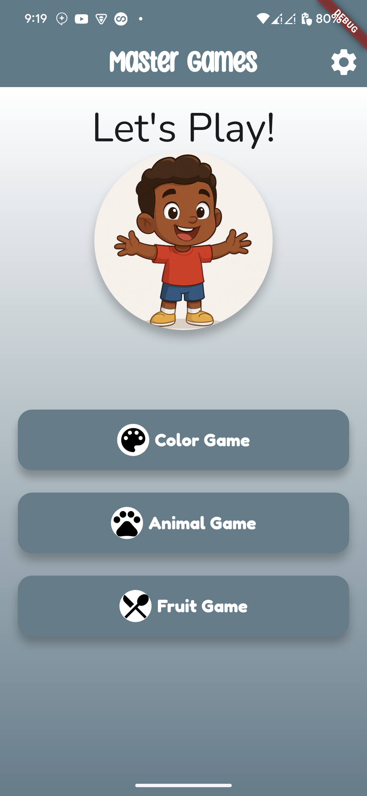

- **Multilingual Support:** Available in:
  - English
  - Arabic (العربية)
  - Amharic (አማርኛ)

**Screenshot 6: App (Lesson) Language Options**

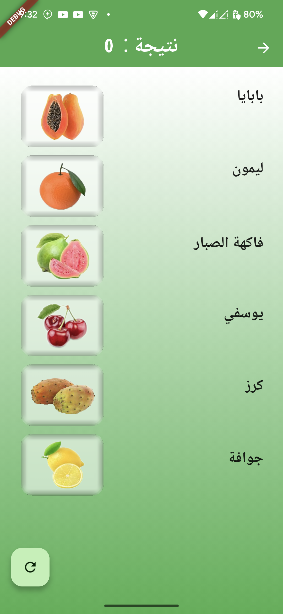
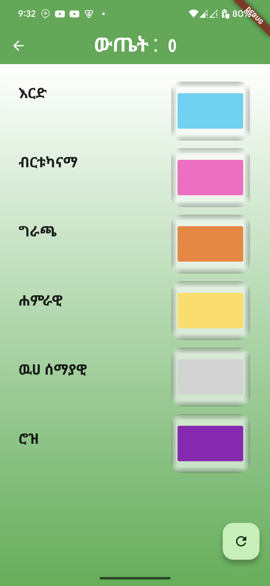

- **Sound Effects:** Engaging sounds for interactions and winning.
- **Responsive Design:** Adapts to different screen sizes.

**Screenshot 7: Other miscellaneous Screenshots**

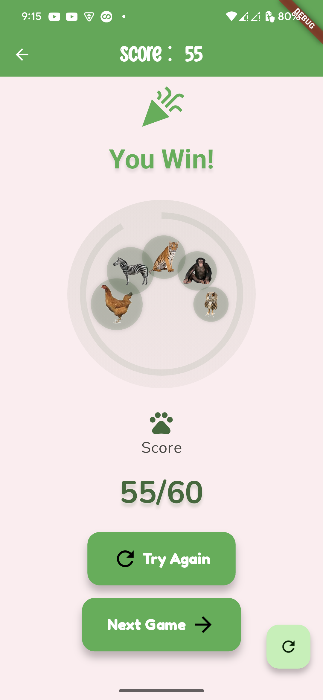
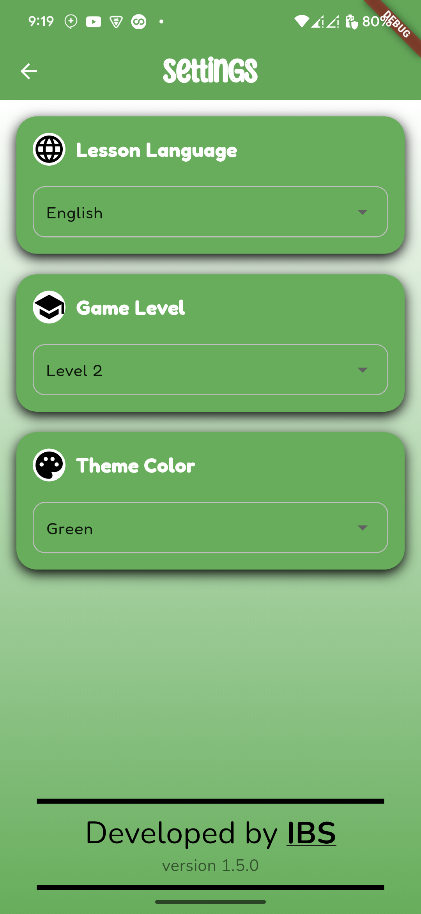

## 🤝 Contributing

Contributions are what make the open-source community such an amazing place to learn, inspire, and create. Any contributions you make are **greatly appreciated**.

---

Happy Matching! 😊
